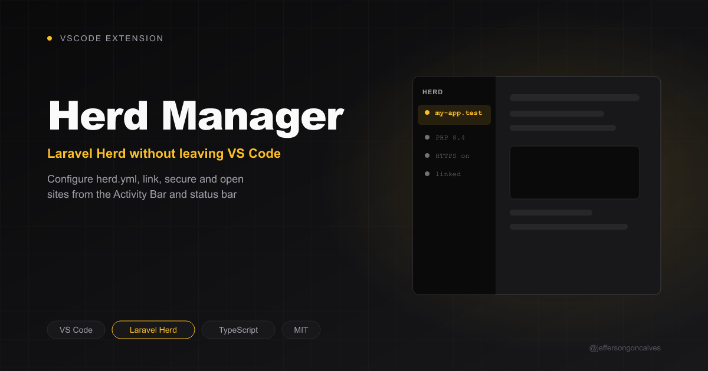

# Herd Manager for VS Code

[](https://buymeacoffee.com/jeffersongoncalves)

> Manage Laravel Herd site configuration directly from VS Code.

**JSG Herd Manager** integrates [Laravel Herd](https://herd.laravel.com) into VS Code: configure the project's `herd.yml`, link/unlink the site, enable HTTPS and open it in the browser without leaving the editor. It is the VS Code port of the [Herd Manager](https://github.com/jeffersongoncalves/herd-manager-plugin) JetBrains plugin.

## Features

- **Auto-detection** — finds Laravel Herd on Windows, macOS and Linux, plus its installed PHP versions and TLD
- **herd.yml configuration** — site name, PHP version and HTTPS from a guided wizard or by clicking the values in the Herd view
- **Link / unlink** — `herd link` (followed by `herd secure` when HTTPS is on) and `herd unlink`
- **Open in browser** — opens `https://<site>.<tld>`
- **Keeps `.env` in sync** — `APP_URL` is updated when the configuration is saved
- **Status bar item** — linked / not linked at a glance; click to open the Herd view
- **Startup hint** — offers to configure or link the project when it isn't yet
- **Reactive** — the view refreshes when `herd.yml` changes on disk

## Requirements

- VS Code 1.85+
- [Laravel Herd](https://herd.laravel.com) installed
- A PHP project folder (the extension activates when the workspace has `herd.yml`, `artisan` or `composer.json`)

## Usage

Open the **Herd** view in the Activity Bar:

| Item | Click to |
|---|---|
| Status | Configure the site (when there's no `herd.yml`) |
| URL | Open the site in the browser |
| Site name | Change the site name |
| PHP | Pick another installed PHP version |
| HTTPS | Toggle HTTPS |

The view toolbar has **Link Site** / **Unlink Site**, **Open in Browser**, **Configure Site** and **Refresh**.

### Commands

| Command | ID |
|---|---|
| Herd: Configure Site | `herd.configure` |
| Herd: Link Site | `herd.link` |
| Herd: Unlink Site | `herd.unlink` |
| Herd: Open in Browser | `herd.openInBrowser` |
| Herd: Change Site Name | `herd.editName` |
| Herd: Change PHP Version | `herd.editPhp` |
| Herd: Toggle HTTPS | `herd.toggleHttps` |
| Herd: Refresh | `herd.refresh` |

### herd.yml

```yaml
name: my-project
php: '8.4'
secured: true
aliases: {}
services: {}
integrations:
    forge: {}
```

## Development

```bash
pnpm install
pnpm run watch   # F5 launches an Extension Development Host
pnpm test        # unit tests (node:test, no VS Code instance needed)
pnpm run lint
pnpm dlx @vscode/vsce package --no-dependencies   # build a .vsix
```

## License

[MIT](LICENSE)

## Author

**Jefferson Goncalves** — [GitHub](https://github.com/jeffersongoncalves)
